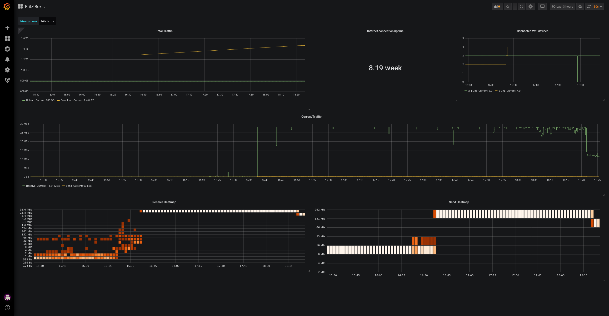

# telegraf-fritzbox - Simple Fritz!Box statistics for your Grafana

## Requirements

* [FritzBoxShell](https://github.com/jhubig/FritzBoxShell)
* telegraf on a system which is in the same network as your Fritz!Box
* InfluxDB reachable by telegraf
* Grafana connected to InfluxDB
* fish shell

## Setup

* Download `telegraf_fritzbox`, put it somewhere on your system, change the variable `fbshell` and test if the script works by executing it
 * Verify that you've set proper permissions and user (e.g. `-rwx------ 1 telegraf root 2125 Jun  3 22:59 /usr/local/bin/telegraf_fritzbox*`)
* Place `fritzbox.conf` into your telegraf config dir, e.g. `/etc/telegraf/telegraf.d/fritzbox.conf` and adjust the path to `telegraf_fritzbox`
* Test the configuration by executing something like `telegraf -test --config /etc/telegraf/telegraf.d/fritzbox.conf`
* Restart telegraf
* Import `grafana_dashboard.json` into your Grafana instance
* Enjoy!

## Example Screenshot

